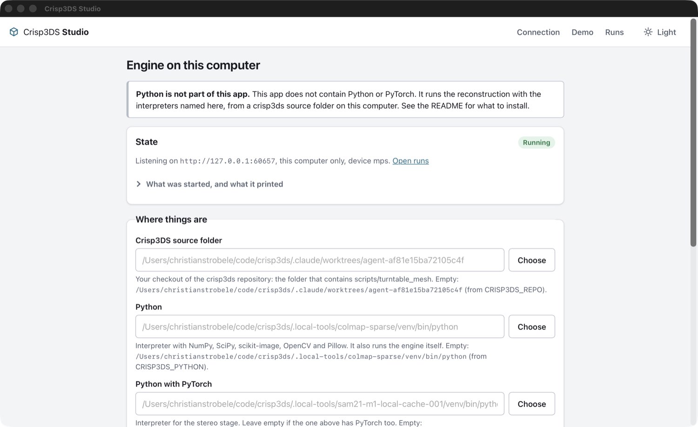

# Crisp3DS Studio

The front end for Crisp3DS's photo-to-STL reconstruction. It shows a run as it
happens: the stages, the surface getting better step by step in a 3D view, the
diagnostic sheets, and the numbers.

Studio does not compute anything. A reconstruction runs on a desktop computer
(the *engine*); Studio is a client of one, or plays back a recorded run. It
relies only on [`docs/ENGINE-CONTRACT.md`](../../docs/ENGINE-CONTRACT.md).

It is one static web app. The same build is meant to be served by the engine,
hosted on any web server, and wrapped by Tauri 2 for desktop and mobile.

| Recorded run, desktop | Live engine run, phone |
| --- | --- |
|  |  |

More screenshots are listed under [Verification](#verification).

## Running it

Node 22.18 or newer.

```sh
cd apps/studio
npm ci
npm run dev        # http://127.0.0.1:1430, demo served straight from tests/fixtures
npm run build      # typecheck, then static files in dist/
npm run preview    # serves dist/ on http://127.0.0.1:1431
npm run lint       # tsc --noEmit (strict)
npm test           # vitest
```

`dist/` uses relative URLs only and hash routes (`#/...`), so it works from any
base path without server rewrites: a site root, `https://user.github.io/repo/`,
the engine's `--static`, or a `tauri://` origin.

### Demo (no engine)

Open the app and choose **Play the demo**, or go to `#/replay`. The recording
is `tests/fixtures/dense-run-sphere/`, copied into `dist/demo/` at build time
(it is not duplicated in git).

### A recorded run (replay bundle)

Make a bundle with
`python -m scripts.turntable_mesh.export_replay --run <run> --output <bundle>`,
put it on any web server, and enter its address under **Recorded run**, or
open `#/replay?bundle=<address>`. The address may be relative to the app
(`big/`) or absolute. A bundle on another origin must be served with CORS
headers.

Playback follows the recorded timing. Speeds are 1×, 4×, 16× and instant (4× to
begin with; the choice is remembered). Pause, step one event forwards or
backwards, or drag the slider to any event; going backwards rebuilds the state
from the first event.

### A live engine

```sh
python -m scripts.turntable_mesh.engine_server --runs <dir> --data <dir> \
  --static apps/studio/dist --port 8765
```

Open `http://127.0.0.1:8765/`. Studio notices that an engine is serving the
page and offers its address; **Connect**, then start a run or open one. A
Studio served from elsewhere (the dev server, a phone on the same network)
connects the same way by typing the engine's address and, if the engine was
started with `--token`, the token.

The address and token are kept in this browser's `localStorage`. The token is
sent only in the `Authorization` header; it is never logged and never put in a
URL. With a token, images are fetched by script and shown through object URLs,
because an `` cannot send the header.

## What it shows

- **Connection**: demo, a bundle address, or an engine (address and token).
- **Runs** (engine): status, the running stage with its progress, start time;
  refreshed every three seconds. **New run**: inputs folder and optional
  reference scan (typed, with suggestions for the folder being typed, or picked
  in a browser of the engine's data directory from `GET /api/data`, where
  folders a run can start from are marked), device, name, and a settings form
  generated from `GET /api/settings`
  (grouped by `group`, `meaning` as help text, one typed input per `kind`,
  lists as comma-separated values). Only values that differ from the defaults
  are sent. "Reset to defaults" and a per-field "Default: ..." link undo
  changes. A `400` from the engine is shown at the field(s) its sentence names
  and once at the form.
- **Run view**:
  - Stage timeline with state, elapsed time, progress and the latest message;
    overall status; cancel (engine); errors with the engine's message.
  - **Surface**: the newest `preview_mesh` / `final_mesh` appears by itself. A
    step strip goes back and forth between surfaces; picking one turns "Follow
    newest" off. The camera stays put when surfaces are swapped and frames the
    bounding box for the first one. Orbit, zoom and pan with mouse, touch or
    keyboard (arrows, `+`, `-`, `0`). Smooth or flat shading. Triangle count.
    "Up" offers ±X, ±Y, ±Z, because the model's frame has no fixed up
    direction; no units are shown, because it has no physical scale.
  - **Diagnostics**: every sheet as a card in arrival order, grouped by stage,
    depth sheets ordered by `level`. A card opens a full-window viewer with
    zoom and pan (wheel, pinch, drag, double-click, `+` `-` `0` `1`, `[` `]`
    for the neighbouring sheets).
  - **Numbers**: `metric` events (latest value per name) and the `report`
    artifacts: mesh report, photo check, scanner evaluation (F1 per threshold,
    accuracy and completeness medians, and the `warnings` text, which is where
    the handedness warning arrives). Unknown JSON is shown as written. Every
    report has its full JSON in a collapsible block.
- Light and dark themes following the system, with a toggle. Layout from
  360 px upwards. All controls are reachable by keyboard and have visible
  focus; images carry their artifact label as text alternative. No external
  requests: system fonts, inline icons, everything bundled.

## Architecture

```
sources  ──events──▶  reducer  ──state──▶  views
(replay | http | local)  (pure)            (Preact components, three.js viewer)
```

```
src/
  core/        no DOM, no network; unit-tested
    events.ts      event type, log parsing (half-written last line is not consumed)
    reducer.ts     (state, event) -> state, plus selectors (sheet grouping, elapsed time, STL size)
    replay.ts      ReplayPlayer: recorded timing, speed, pause, scrub, step; clock injected
    settings.ts    settings form logic: text <-> typed values, diff against defaults, error placement
    reports.ts     report JSON -> rows; unknown shapes fall through to raw JSON
    stl.ts         binary STL -> indexed mesh (welded vertices, smooth normals, bounds), resumable
    format.ts      durations, sizes, counts
  sources/     no DOM; `fetch` and timers injected; unit-tested
    types.ts       RunSource and Engine: the one interface the views use
    replaySource.ts   bundle -> ReplayPlayer -> updates
    httpEngine.ts     HttpEngine (health, settings, runs, start) and HttpRunSource (polling, files, cancel)
    localEngine.ts    STUB for the Tauri shell: same shape, not implemented
    runStore.ts       folds a source's updates into RunState with the reducer
  viewer/      three.js; loaded on demand
    viewer.ts      scene, camera, controls, lighting, up axis, render on demand
    meshLoader.ts  download with progress, parse in a worker, LRU cache of parsed meshes
    stl.worker.ts  the worker
  ui/          Preact components and the stylesheet's class names
```

Things worth knowing:

- **One reducer.** Replay, HTTP and (later) local all deliver
  `{type: "events" | "reset" | "link"}` updates. `events` are appended;
  `reset` (replay scrubbing backwards) recomputes from the first event. Unknown
  event types, artifact kinds and fields are ignored; unknown stages are
  appended to the timeline; an unknown schema name gives a notice and the rest
  still works.
- **Polling.** `GET .../events?since=N` once a second. On an error the wait
  becomes 1, 2, 4, 8, then 15 s, the notice says why, and the cursor is kept,
  so nothing is lost or applied twice. `401`, `403` and `404` stop polling.
  Polling ends at `run_finished`.
- **Meshes.** Only the surface that is to be shown is downloaded. Parsing
  happens in a worker (in slices on the main thread if a worker cannot start).
  Identical vertices are welded, so a closed mesh takes about half of the
  STL's size in memory and smooth normals come for free; flat shading is done by the
  material on the same buffers. GPU buffers exist only for the mesh on screen
  and are disposed on every swap. Parsed meshes are cached up to 192 MB, least
  recently used first out.
- **The final mesh.** A binary STL is exactly `84 + 50 × triangles` bytes, so
  its size is known from the event; when `triangles` is missing the file is
  asked for its size with `HEAD`. Above 12 MB (or when neither says) the final
  mesh is not fetched until the "Load final surface (51 MB)" button is pressed;
  the newest preview stays on screen meanwhile.
- **Rendering on demand.** There is no animation loop; a still model costs
  nothing.

### Dependencies and licenses

Studio itself is AGPL-3.0-only, like the rest of Crisp3DS.

Shipped in the web bundle (runtime):

| Package | Use | License |
| --- | --- | --- |
| `three` 0.186.1 | 3D viewer | MIT |
| `preact` 11.0.0 | view library (about 5 kB gzipped) | MIT |
| `@tauri-apps/api` 2.11.1 | talking to the native shell; inert in a browser | Apache-2.0 OR MIT |

Linked into the native shell (Rust, direct dependencies):

| Crate | Use | License |
| --- | --- | --- |
| `tauri` 2.11.6, `tauri-build` 2.6.3 | the shell | Apache-2.0 OR MIT |
| `tauri-plugin-dialog` 2 | native folder and file pickers (desktop launcher variant only) | Apache-2.0 OR MIT |
| `serde` 1, `serde_json` 1 | settings file, messages to the web view | MIT OR Apache-2.0 |
| `getrandom` 0.3 | the engine's per-start token (desktop launcher variant only) | MIT OR Apache-2.0 |
| `libc` 0.2 | process groups and signals on Unix | MIT OR Apache-2.0 |

Development only (not shipped):

| Package | Use | License |
| --- | --- | --- |
| `vite` 8, `vitest` 5 | build, tests | MIT |
| `typescript` 7 | typecheck; `npm run lint` is `tsc --noEmit` | Apache-2.0 |
| `@types/three`, `@types/node` | types | MIT |
| `@tauri-apps/cli` 2.11.5 | building the shell | Apache-2.0 OR MIT |
| `playwright` 1.63 | screenshot and performance scripts only | Apache-2.0 |

Transitive dependencies (307 crates are linked across all platforms) are
audited by `npm run licenses`, which writes
[`docs/THIRD-PARTY-LICENSES.md`](docs/THIRD-PARTY-LICENSES.md) and
`docs/licenses.json`; CI fails on a license outside the policy. Current
result: **clean with obligations** (attribution, and four MPL-2.0 crates whose
source must stay available). To list them yourself: `npm ls --all --omit=dev`
and `cargo tree --manifest-path src-tauri/Cargo.toml -e normal`.

No UI kit, CSS framework or state library. `typescript-eslint` is not used
because it does not support TypeScript 7 yet.

## Verification

Unit tests (`npm test`, 116 tests): the reducer on the recorded sphere run and
on unknown events, kinds, fields, stages and schema; half-written last lines;
replay timing, speeds, pause, scrub and step with a fake clock; the STL parser
on all four fixture meshes (triangle counts as announced, closed and
consistently oriented, Euler characteristic 2, same vertex count as the mesh
report) and on broken input; settings parsing, diffing and error placement;
HTTP polling, backoff and cursor handling, token handling, and the replay
source, with a fake `fetch`.

In a real browser (headless Chromium through Playwright), against the built
app:

```sh
npx playwright install --only-shell chromium
npm run build && npm run preview &
npm run screenshots                                   # replay
STUDIO_URL=http://127.0.0.1:8765/ STUDIO_ENGINE_INPUTS=sphere STUDIO_ENGINE_EXTRAS=1 \
  npm run screenshots                                 # live engine, see the script's header
```

The engine pass connects through the form, provokes a validation error, starts
a small synthetic run through the settings form, watches it live on a desktop
and a phone viewport at the same time, waits for the end, then cancels a second
run. It was also run against an engine started with `--token` (wrong token
refused with a clear message; images and meshes load with the right one).

| | |
| --- | --- |
|  Recording, finished, 1440 px |  Scrubbed back to event 12: stereo running, an earlier surface |
|  Dark theme |  Sheet viewer, zoomed |
|  Live engine run, first surface |  The same run, finished |
|  The engine's validation message at its field |  A run cancelled from the UI |
|  Runs list |  Connection |

| 390 px | 360 px | Gallery, 390 px | Live, 390 px |
| --- | --- | --- | --- |
|  |  |  |  |

### Large runs

Measured with `scripts/perf-check.mjs` on a real run: the Bunny bundle
(65 events; previews of 260 000 to 287 000 triangles, 13 to 14 MB each; final
STL 1 047 922 triangles, 52.4 MB; ten sheets up to 1800 px wide; a scanner
evaluation with a handedness warning). Apple M1, real GPU
(`STUDIO_GL=metal`), served from localhost, headless Chromium:

- only the newest preview is downloaded; the final mesh waits for its
  "Load final surface (52 MB)" button, at desktop and phone width;
- first surface on screen 0.35 to 0.5 s after opening the page (2.5 s on the
  very first, cold launch);
- the 52 MB final mesh on screen 1.0 s after the click, longest main-thread
  pause 54 ms;
- swapping between cached surfaces 50 to 120 ms; 30 orbit steps on the final
  mesh in 0.7 s;
- all three reports are summarised and the handedness warning is shown; no
  sideways scrolling at 390 px.

Nothing had to be changed for the real bundle. Its sheets are not megapixel
sized, so the thumbnail question stays open: a synthetic test with sheets
scaled to 4200 × 4200 worked, with a pause of 0.2 to 0.4 s when one is opened
at 1:1. Not measured: real phones, and memory on a device with little of it.

```sh
STUDIO_GL=metal STUDIO_BUNDLE=<address> STUDIO_OUT=<folder> node scripts/perf-check.mjs
```

## The desktop app

`src-tauri/` wraps the same web app with Tauri 2. On macOS, Windows and Linux
the app **starts the engine itself**:

```
<python> -m scripts.turntable_mesh.engine_server --runs <dir> --data <dir> \
  --host 127.0.0.1 --port <free port> --token <random> --device <device> \
  --python <python> --torch-python <torch python>          (PYTHONPATH=<repo>, cwd=<repo>)
```

It waits for `/api/health`, hands address and token to the web view (which
opens on **Runs** instead of the connection form), and ends the engine and its
process group when the app quits. Another engine or the demo remain one click
away under **Connection**.

> **Python is not part of the app.** No Python, PyTorch or any reconstruction
> code is bundled. The app runs the interpreters you name, in a crisp3ds
> checkout on your computer. The settings screen says so as well.

| The app running a reconstruction | Engine settings |
| --- | --- |
|  |  |

### Running it from a fresh clone

Needs Node 22.18+, a Rust toolchain (stable), the
[Tauri 2 system prerequisites](https://tauri.app/start/prerequisites/) for
your OS (on Linux: `libwebkit2gtk-4.1-dev libgtk-3-dev
libayatana-appindicator3-dev librsvg2-dev libxdo-dev libssl-dev`), and Python
3.11 with the pipeline's requirements.

```sh
git clone https://github.com/CrispStrobe/crisp3ds && cd crisp3ds

# 1. Python for the engine (one environment with everything is the simplest)
python3 -m venv .venv
.venv/bin/pip install -r scripts/turntable_mesh/requirements-dense.txt

# 2. Something to reconstruct: a synthetic scene in a data folder
mkdir -p ~/crisp3ds-data
PYTHONPATH=$PWD .venv/bin/python -m scripts.turntable_mesh.synthetic_scene --output ~/crisp3ds-data/sphere

# 3. The app
cd apps/studio
npm ci
CRISP3DS_DATA_DIR=~/crisp3ds-data npm run tauri dev          # or: npm run tauri build -- --debug --no-bundle
```

The app finds the checkout it was built in and a `.venv` inside it by itself.
Then: **New run**, **Browse** to `sphere`, **Start run**. For the small scene
use the settings printed by `synthetic_scene` (sizes 64, 128; grid 96; ...);
the defaults are meant for megapixel photos.

Where the settings come from, first match wins:

1. the **Engine settings** screen (saved as `config.json` in the app's config
   folder: `~/Library/Application Support/dev.crisp3ds.studio/` on macOS,
   `%APPDATA%\dev.crisp3ds.studio\` on Windows, `~/.config/dev.crisp3ds.studio/`
   on Linux), with native pickers for folders and interpreters;
2. the environment: `CRISP3DS_REPO`, `CRISP3DS_PYTHON`,
   `CRISP3DS_TORCH_PYTHON`, `CRISP3DS_RUNS_DIR`, `CRISP3DS_DATA_DIR`;
3. discovery: a checkout above the executable or the working directory, and
   `.venv` in it; otherwise `python3` (`python` on Windows) from `PATH`, the
   same interpreter for PyTorch, and `runs/` and `data/` in the app's data
   folder. Device `auto` is `mps` on Apple Silicon and `cpu` elsewhere.

When the engine cannot start, the app shows why, the command it ran (token
blanked) and the last lines the engine printed, with a button to the settings.

### What the web view is allowed to do

- Content Security Policy: scripts, styles and workers only from the app
  itself; `object-src 'none'`, no frames, no forms, no remote code.
  `connect-src` and `img-src` additionally allow `http:` and `https:` (and
  `blob:`, `data:` for images). That is wider than `http://127.0.0.1:*`
  only, deliberately: the same app must reach an engine on another machine
  and replay bundles on any server, on desktop and on phones.
- Tauri capabilities: **none**. The window may call the shell's own six
  commands (shell info, read and save settings, engine status, restart engine,
  pick a path) and nothing else: no file system, shell, HTTP or dialog plugin
  access from JavaScript. The native pickers are opened by the Rust side.
- The engine listens on `127.0.0.1` only and requires the per-start token,
  which lives in memory and is never written to disk or shown.

### How it was verified, and what was not

On an Apple M1 (macOS), with a debug build (`tauri build --debug --no-bundle`,
i.e. the real `tauri://` origin and the production CSP) and the interpreters
from two virtual environments given through the environment variables:

- the app started the engine and opened on its runs;
- a synthetic sphere run was started through the app's own form (inputs found
  with the folder browser, eleven settings typed, device cpu) and ran to
  **Complete**: four surfaces appeared in turn in the 3D view, 8 of 8 sheets
  loaded, photo check and mesh report shown, **no CSP violation**;
- after quitting through the app, and separately after `kill -TERM` of the
  app, no engine process was left;
- the client-only variant (below), ad-hoc signed with the App Sandbox
  entitlements, starts and shows the connection screen without the local
  engine.

This was driven by `scripts/autopilot-run.js`, which the **debug** build runs
inside its own web view when `CRISP3DS_STUDIO_AUTOPILOT=<file>` is set
(release builds contain neither that hook nor its two helper commands).

Not verified by a person or at all:

- **Clicking.** The native folder pickers and saving on the settings screen
  were not operated by hand; the settings logic is covered by Rust unit tests.
- **`tauri dev`** (the development CSP) was not run; only the debug build was.
- **Windows and Linux** were only compiled and unit-tested in CI. In
  particular, untested there:
  - *Windows*: the engine is started with `CREATE_NEW_PROCESS_GROUP |
    CREATE_NO_WINDOW` and ended with `taskkill /PID <pid> /T /F`, which takes
    the whole process tree. The engine starts runs as ordinary children on
    Windows, so **a run in progress is killed with the app**. There is no
    handler for the app itself being killed; an engine can then be left
    behind.
  - *Linux and macOS*: the engine gets its own process group
    (`setpgid`), ended with `SIGTERM`, then `SIGKILL` after 4 s; `SIGINT`,
    `SIGTERM` and `SIGHUP` to the app take the group along. The engine starts
    each run in a new session, so **a run in progress survives the app** and
    keeps computing with nothing serving it; its result is there at the next
    start. If the app is killed with `SIGKILL` or crashes, the engine is left
    running.
  - *Linux*: needs WebKitGTK 4.1 with working WebGL.
- **Android and iOS** builds are produced in CI only (debug APK, simulator
  app). They were not installed or started.

### Two variants of the Mac app, and phones

| Variant | Built with | Engine launcher | For |
| --- | --- | --- | --- |
| Desktop (default) | `tauri build` | yes | direct download: `.dmg`, Windows installer, AppImage, `.deb` |
| Client only | `tauri build -- --no-default-features` | compiled out | Mac App Store and TestFlight |
| Phones | `tauri android build`, `tauri ios build` | never | Android, iOS |

App Store builds of the Mac app must run in the App Sandbox, and a sandboxed
app cannot start a Python that the user installed somewhere on the disk. The
store variant is therefore the same app without the `local-engine` cargo
feature: it opens on the connection screen (engine address and token, demo,
recorded runs), exactly like the phone apps. Its files are
`src-tauri/tauri.appstore.conf.json` (bundling and entitlements; the store
bundle identifier is the owner's to choose and is passed at build time) and
`src-tauri/entitlements.appstore.plist` (`app-sandbox` and `network.client`,
nothing else). `src-tauri/Info.plist` and `Info.ios.plist` declare
`ITSAppUsesNonExemptEncryption = false` (the app uses only the system's HTTP
and HTTPS), allow plain HTTP to local-network addresses only
(`NSAllowsLocalNetworking`), and carry the local-network usage text.

Nothing has been uploaded to App Store Connect. See
[`docs/RELEASING.md`](../../docs/RELEASING.md) for what exists, what is
missing and what only the account owner can do.

### Shipping without a separately installed Python (not implemented)

| Option | What it is | Rough size added | Notes |
| --- | --- | --- | --- |
| Bundled CPython + wheels, CPU only | A relocatable Python (python-build-standalone) with numpy, scipy, scikit-image, opencv-headless, pillow and CPU PyTorch as an app resource or sidecar | about 0.6 to 0.9 GB installed (PyTorch CPU alone is about 200 MB compressed, 500+ MB unpacked) | Simplest. Slow on real photo sets without a GPU. Every binary inside must be signed for macOS notarisation. |
| The same with GPU PyTorch | MPS comes with the normal macOS arm64 wheel (no extra size); CUDA wheels add the CUDA runtime | macOS: as above; Windows/Linux with CUDA: 2.5 to 5 GB | CUDA has never been run on a GPU by this project. |
| Frozen engine (PyInstaller or Nuitka) as a Tauri sidecar | One executable per OS and architecture | about the same as the first row; start-up of a one-file build is slow | The pipeline starts its stages with `python -m ...`; that would have to become in-process calls or a multi-call executable. |
| Download on first run | The app fetches a pinned environment (for example with `uv`) into its data folder | installer stays small (about 10 MB); 0.6 to 5 GB downloaded once | Needs network on first use, and a UI for progress and failure. Probably the best trade for direct downloads. |
| Rewrite the hot paths natively (Rust or C++ with Metal/wgpu) | No Python at all | tens of MB | The only route to a self-contained **store** build that reconstructs; a large project. |

None of these fit the Mac App Store as they are: bundled interpreters must be
signed and sandbox-safe, downloaded code is not allowed there, and the
licenses of everything bundled would have to pass the same audit as the app
(`docs/THIRD-PARTY-LICENSES.md` covers only what ships today).

## Releases

`.github/workflows/release.yml` builds the web bundle, the bundled desktop
apps, the mobile probes and the pipeline's source archive, and on a `v*` tag
creates a **draft prerelease**. `scripts/set-version.mjs` keeps
`package.json`, `tauri.conf.json` and `Cargo.toml` on one version. Signing is
off until its secrets exist: `APPLE_CERTIFICATE`,
`APPLE_CERTIFICATE_PASSWORD`, `APPLE_SIGNING_IDENTITY`, `APPLE_ID`,
`APPLE_PASSWORD`, `APPLE_TEAM_ID` (macOS), `WINDOWS_CERTIFICATE`,
`WINDOWS_CERTIFICATE_PASSWORD` (Windows). The procedure is in
[`docs/RELEASING.md`](../../docs/RELEASING.md).

## Implemented, and not

Implemented: everything under [What it shows](#what-it-shows); the replay and
HTTP sources; the demo; the desktop shell with its engine launcher.

Not implemented:

- **The local source** (`sources/localEngine.ts`) is still a stub. The desktop
  app does not need it: it talks to its own engine over HTTP on localhost.
  Reading run folders directly would only pay off if that hop became a burden.
- **Photo upload and capture.** Not in the contract yet, so a phone cannot
  send photos.
- **Photos to inputs.** The engine has a photos-to-inputs stage now; Studio
  does not offer it yet. Runs start from a prepared inputs folder.
- **Thumbnails and compact meshes.** Gallery cards show the full sheet scaled
  down; the contract has no thumbnail or decimated-mesh artifact yet.
- **Deleting or renaming runs, a download button for the STL**: no endpoint for
  the first two; the STL is at `<engine>/api/runs/<id>/files/mesh/mesh.stl`.
- **Engine discovery on the network** (mDNS or a QR code with address and
  token), so nobody types an address on a phone.
- **Push updates.** Studio polls, as the contract says.
- **Mesh formats other than binary STL.** A text STL is refused with a clear
  message.
- **Installable PWA / offline shell**: no service worker.
- **Translations.** English only.
- **Asking before quitting while a run is in progress.**

Runs recorded before the engine announced the photo check as a `report`
artifact still show it: for those, a live engine is asked for
`check/result.json` by its conventional path once the check stage is done.
