# Crisp3DS Studio

The front end for Crisp3DS's photo-to-STL reconstruction. It shows a run as it
happens: the stages, the surface getting better step by step in a 3D view, the
diagnostic sheets, and the numbers.

As a web page Studio does not compute anything: it is a client of an *engine*
on some computer, or plays back a recorded run. As an app (Tauri) it has the
engine built in: the native dense pipeline, `crates/dense`, runs inside the
app. Either way it relies only on
[`docs/ENGINE-CONTRACT.md`](../../docs/ENGINE-CONTRACT.md).

It is one static web app. The same build is meant to be served by the engine,
hosted on any web server, and wrapped by Tauri 2 for desktop and mobile.

| Recorded run, desktop | Live engine run, phone |
| --- | --- |
| 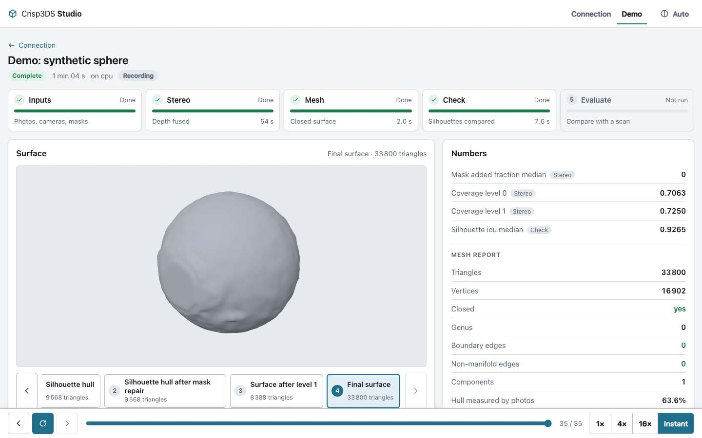 | 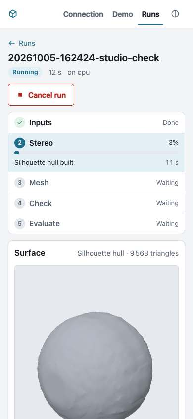 |

More screenshots are listed under [Verification](#verification).

## Running it

Node 22.18 or newer.

```sh
cd apps/studio
npm ci
npm run dev        # http://127.0.0.1:1430, demo served straight from tests/fixtures
npm run build      # typecheck, then static files in dist/
npm run preview    # serves dist/ on http://127.0.0.1:1431
npm run lint       # tsc --noEmit (strict)
npm test           # vitest
```

`dist/` uses relative URLs only and hash routes (`#/...`), so it works from any
base path without server rewrites: a site root, `https://user.github.io/repo/`,
the engine's `--static`, or a `tauri://` origin.

### Demo (no engine)

Open the app and choose **Play the demo**, or go to `#/replay`. The recording
is `tests/fixtures/dense-run-sphere/`, copied into `dist/demo/` at build time
(it is not duplicated in git).

### A recorded run (replay bundle)

Make a bundle with
`python -m scripts.turntable_mesh.export_replay --run <run> --output <bundle>`,
put it on any web server, and enter its address under **Recorded run**, or
open `#/replay?bundle=<address>`. The address may be relative to the app
(`big/`) or absolute. A bundle on another origin must be served with CORS
headers.

Playback follows the recorded timing. Speeds are 1×, 4×, 16× and instant (4× to
begin with; the choice is remembered). Pause, step one event forwards or
backwards, or drag the slider to any event; going backwards rebuilds the state
from the first event.

### A live engine

```sh
python -m scripts.turntable_mesh.engine_server --runs <dir> --data <dir> \
  --static apps/studio/dist --port 8765
```

Open `http://127.0.0.1:8765/`. Studio notices that an engine is serving the
page and offers its address; **Connect**, then start a run or open one. A
Studio served from elsewhere (the dev server, a phone on the same network)
connects the same way by typing the engine's address and, if the engine was
started with `--token`, the token.

The address and token are kept in this browser's `localStorage`. The token is
sent only in the `Authorization` header; it is never logged and never put in a
URL. With a token, images are fetched by script and shown through object URLs,
because an `` cannot send the header.

## What it shows

- **Connection**: demo, a bundle address, or an engine (address and token).
- **Runs** (engine): status, the running stage with its progress, start time;
  refreshed every three seconds. **New run**: inputs folder and optional
  reference scan (typed, with suggestions for the folder being typed, or picked
  in a browser of the engine's data directory from `GET /api/data`, where
  folders a run can start from are marked), device, name, and a settings form
  generated from `GET /api/settings`
  (grouped by `group`, `meaning` as help text, one typed input per `kind`,
  lists as comma-separated values). Only values that differ from the defaults
  are sent. "Reset to defaults" and a per-field "Default: ..." link undo
  changes. A `400` from the engine is shown at the field(s) its sentence names
  and once at the form.
- **Run view**:
  - Stage timeline with state, elapsed time, progress and the latest message;
    overall status; cancel (engine); errors with the engine's message.
  - **Surface**: the newest `preview_mesh` / `final_mesh` appears by itself. A
    step strip goes back and forth between surfaces; picking one turns "Follow
    newest" off. The camera stays put when surfaces are swapped and frames the
    bounding box for the first one. Orbit, zoom and pan with mouse, touch or
    keyboard (arrows, `+`, `-`, `0`). Smooth or flat shading. Triangle count.
    "Up" offers ±X, ±Y, ±Z, because the model's frame has no fixed up
    direction; no units are shown, because it has no physical scale.
  - **Diagnostics**: every sheet as a card in arrival order, grouped by stage,
    depth sheets ordered by `level`. A card opens a full-window viewer with
    zoom and pan (wheel, pinch, drag, double-click, `+` `-` `0` `1`, `[` `]`
    for the neighbouring sheets).
  - **Numbers**: `metric` events (latest value per name) and the `report`
    artifacts: mesh report, photo check, scanner evaluation (F1 per threshold,
    accuracy and completeness medians, and the `warnings` text, which is where
    the handedness warning arrives). Unknown JSON is shown as written. Every
    report has its full JSON in a collapsible block.
- Light and dark themes following the system, with a toggle. Layout from
  360 px upwards. All controls are reachable by keyboard and have visible
  focus; images carry their artifact label as text alternative. No external
  requests: system fonts, inline icons, everything bundled.

## Architecture

```
sources  ──events──▶  reducer  ──state──▶  views
(replay | http | local)  (pure)            (Preact components, three.js viewer)
```

```
src/
  core/        no DOM, no network; unit-tested
    events.ts      event type, log parsing (half-written last line is not consumed)
    reducer.ts     (state, event) -> state, plus selectors (sheet grouping, elapsed time, STL size)
    replay.ts      ReplayPlayer: recorded timing, speed, pause, scrub, step; clock injected
    settings.ts    settings form logic: text <-> typed values, diff against defaults, error placement
    reports.ts     report JSON -> rows; unknown shapes fall through to raw JSON
    stl.ts         binary STL -> indexed mesh (welded vertices, smooth normals, bounds), resumable
    format.ts      durations, sizes, counts
  sources/     no DOM; `fetch` and timers injected; unit-tested
    types.ts       RunSource and Engine: the one interface the views use
    replaySource.ts   bundle -> ReplayPlayer -> updates
    httpEngine.ts     HttpEngine (health, settings, runs, start) and HttpRunSource (polling, files, cancel)
    localEngine.ts    the engine built into the app, over the shell's commands (injected bridge)
    runStore.ts       folds a source's updates into RunState with the reducer
  viewer/      three.js; loaded on demand
    viewer.ts      scene, camera, controls, lighting, up axis, render on demand
    meshLoader.ts  download with progress, parse in a worker, LRU cache of parsed meshes
    stl.worker.ts  the worker
  ui/          Preact components and the stylesheet's class names
```

Things worth knowing:

- **One reducer.** Replay, HTTP and (later) local all deliver
  `{type: "events" | "reset" | "link"}` updates. `events` are appended;
  `reset` (replay scrubbing backwards) recomputes from the first event. Unknown
  event types, artifact kinds and fields are ignored; unknown stages are
  appended to the timeline; an unknown schema name gives a notice and the rest
  still works.
- **Polling.** `GET .../events?since=N` once a second. On an error the wait
  becomes 1, 2, 4, 8, then 15 s, the notice says why, and the cursor is kept,
  so nothing is lost or applied twice. `401`, `403` and `404` stop polling.
  Polling ends at `run_finished`.
- **Meshes.** Only the surface that is to be shown is downloaded. Parsing
  happens in a worker (in slices on the main thread if a worker cannot start).
  Identical vertices are welded, so a closed mesh takes about half of the
  STL's size in memory and smooth normals come for free; flat shading is done by the
  material on the same buffers. GPU buffers exist only for the mesh on screen
  and are disposed on every swap. Parsed meshes are cached up to 192 MB, least
  recently used first out.
- **The final mesh.** A binary STL is exactly `84 + 50 × triangles` bytes, so
  its size is known from the event; when `triangles` is missing the file is
  asked for its size with `HEAD`. Above 12 MB (or when neither says) the final
  mesh is not fetched until the "Load final surface (51 MB)" button is pressed;
  the newest preview stays on screen meanwhile.
- **Rendering on demand.** There is no animation loop; a still model costs
  nothing.

### Dependencies and licenses

Studio itself is AGPL-3.0-only, like the rest of Crisp3DS.

Shipped in the web bundle (runtime):

| Package | Use | License |
| --- | --- | --- |
| `three` 0.186.1 | 3D viewer | MIT |
| `preact` 11.0.0 | view library (about 5 kB gzipped) | MIT |
| `@tauri-apps/api` 2.11.1 | talking to the native shell; inert in a browser | Apache-2.0 OR MIT |

Linked into the native shell (Rust, direct dependencies):

| Crate | Use | License |
| --- | --- | --- |
| `tauri` 2.11.6, `tauri-build` 2.6.3 | the shell | Apache-2.0 OR MIT |
| `crisp3ds-dense` (this repository) | the reconstruction engine; brings `wgpu` 30, `image`, `rayon` and others | AGPL-3.0-only (the project's own) |
| `anyhow` 1 | errors of the engine's API | MIT OR Apache-2.0 |
| `tauri-plugin-dialog` 2 | native folder and file pickers (desktop) | Apache-2.0 OR MIT |
| `serde` 1, `serde_json` 1 | settings file, messages to the web view | MIT OR Apache-2.0 |
| `getrandom` 0.3 | the external Python engine's per-start token (desktop) | MIT OR Apache-2.0 |
| `libc` 0.2 | process groups and signals on Unix | MIT OR Apache-2.0 |

Development only (not shipped):

| Package | Use | License |
| --- | --- | --- |
| `vite` 8, `vitest` 5 | build, tests | MIT |
| `typescript` 7 | typecheck; `npm run lint` is `tsc --noEmit` | Apache-2.0 |
| `@types/three`, `@types/node` | types | MIT |
| `@tauri-apps/cli` 2.11.5 | building the shell | Apache-2.0 OR MIT |
| `playwright` 1.63 | screenshot and performance scripts only | Apache-2.0 |

Transitive dependencies (365 crates are linked across all platforms) are
audited by `npm run licenses`, which writes
[`docs/THIRD-PARTY-LICENSES.md`](docs/THIRD-PARTY-LICENSES.md) and
`docs/licenses.json`; CI fails on a license outside the policy. Current
result: **clean with obligations** (attribution, and four MPL-2.0 crates whose
source must stay available). To list them yourself: `npm ls --all --omit=dev`
and `cargo tree --manifest-path src-tauri/Cargo.toml -e normal`.

No UI kit, CSS framework or state library. `typescript-eslint` is not used
because it does not support TypeScript 7 yet.

## Verification

Unit tests (`npm test`, 126 tests; `cargo test` in `src-tauri`, 29 tests): the reducer on the recorded sphere run and
on unknown events, kinds, fields, stages and schema; half-written last lines;
replay timing, speeds, pause, scrub and step with a fake clock; the STL parser
on all four fixture meshes (triangle counts as announced, closed and
consistently oriented, Euler characteristic 2, same vertex count as the mesh
report) and on broken input; settings parsing, diffing and error placement;
HTTP polling, backoff and cursor handling, token handling, and the replay
source, with a fake `fetch`.

In a real browser (headless Chromium through Playwright), against the built
app:

```sh
npx playwright install --only-shell chromium
npm run build && npm run preview &
npm run screenshots                                   # replay
STUDIO_URL=http://127.0.0.1:8765/ STUDIO_ENGINE_INPUTS=sphere STUDIO_ENGINE_EXTRAS=1 \
  npm run screenshots                                 # live engine, see the script's header
```

The engine pass connects through the form, provokes a validation error, starts
a small synthetic run through the settings form, watches it live on a desktop
and a phone viewport at the same time, waits for the end, then cancels a second
run. It was also run against an engine started with `--token` (wrong token
refused with a clear message; images and meshes load with the right one).

| | |
| --- | --- |
|  Recording, finished, 1440 px | 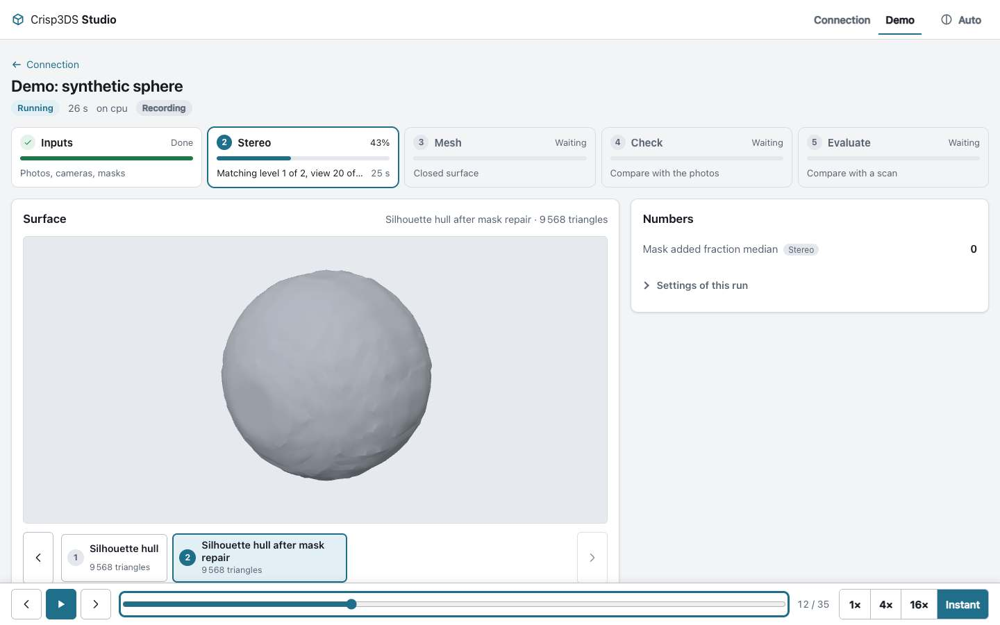 Scrubbed back to event 12: stereo running, an earlier surface |
| 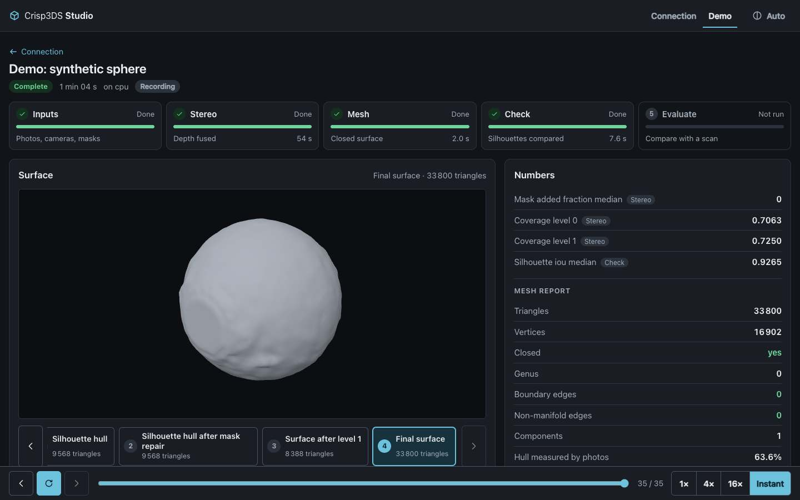 Dark theme | 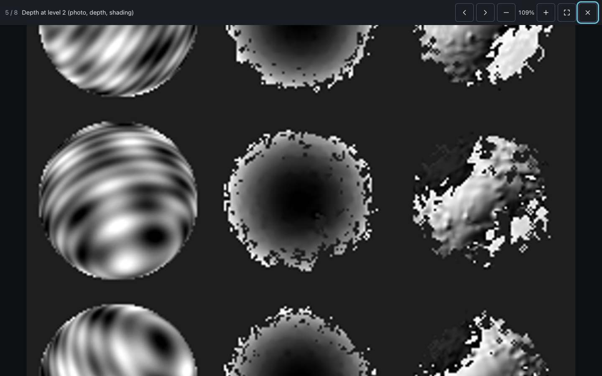 Sheet viewer, zoomed |
| 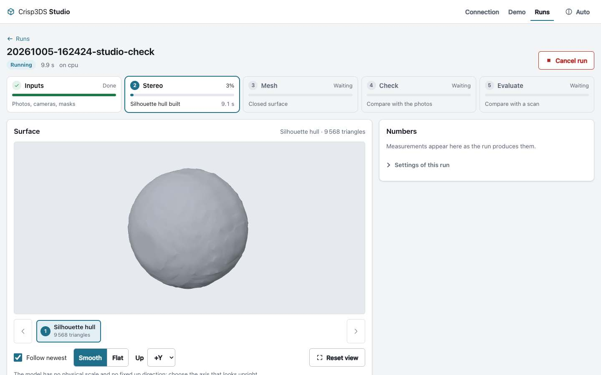 Live engine run, first surface | 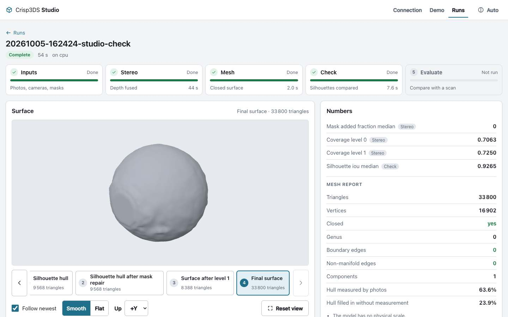 The same run, finished |
| 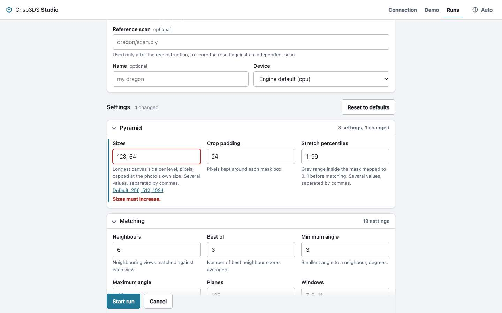 The engine's validation message at its field | 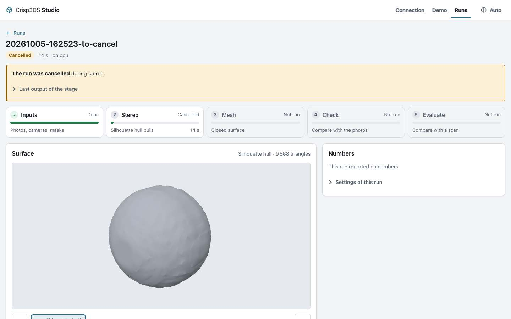 A run cancelled from the UI |
| 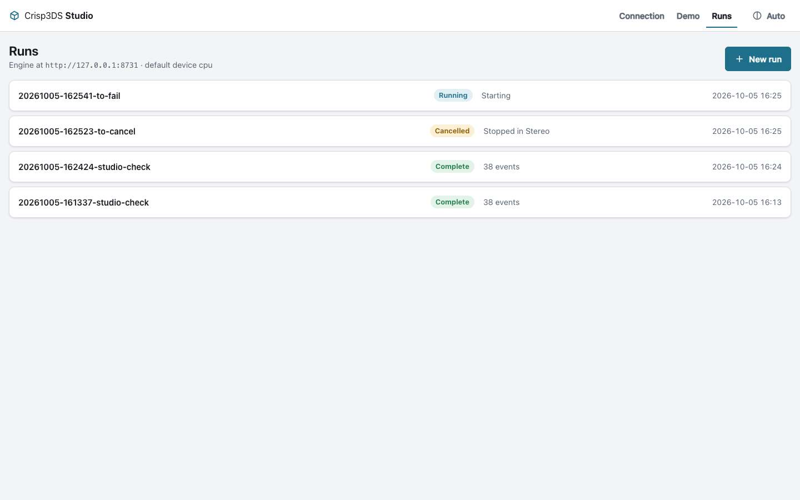 Runs list | 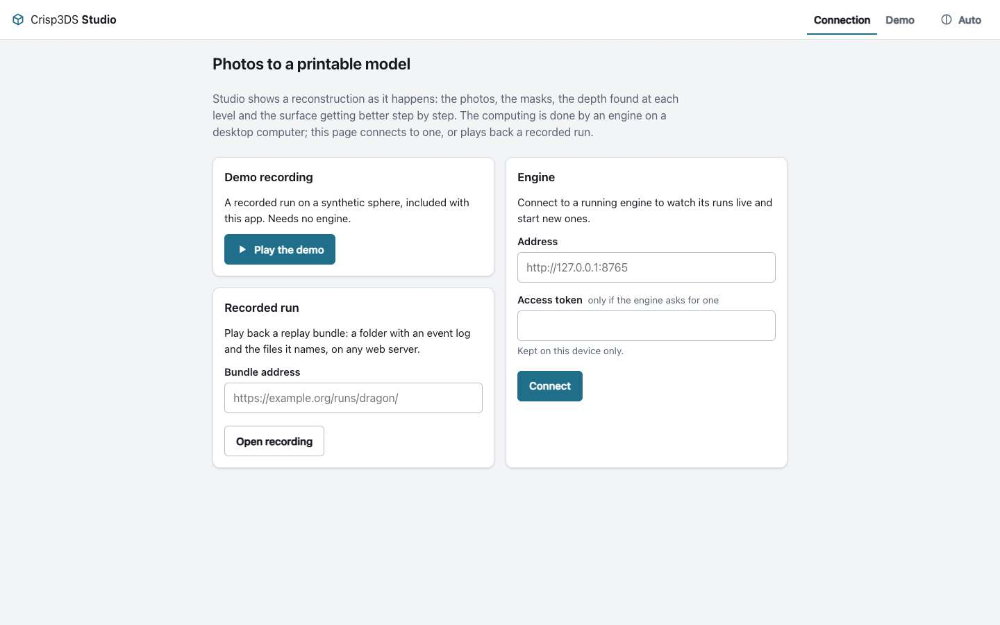 Connection |

| 390 px | 360 px | Gallery, 390 px | Live, 390 px |
| --- | --- | --- | --- |
| 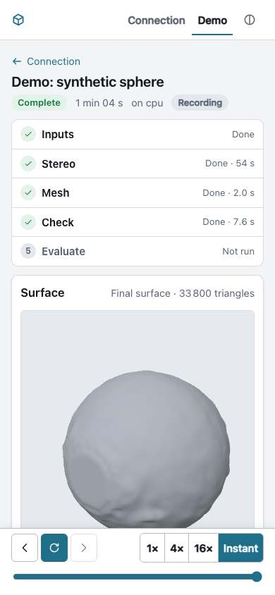 | 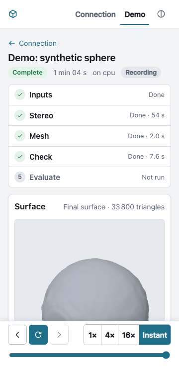 | 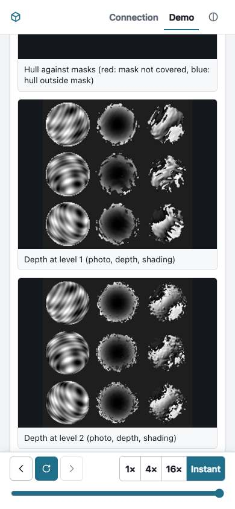 |  |

### Large runs

Measured with `scripts/perf-check.mjs` on a real run: the Bunny bundle
(65 events; previews of 260 000 to 287 000 triangles, 13 to 14 MB each; final
STL 1 047 922 triangles, 52.4 MB; ten sheets up to 1800 px wide; a scanner
evaluation with a handedness warning). Apple M1, real GPU
(`STUDIO_GL=metal`), served from localhost, headless Chromium:

- only the newest preview is downloaded; the final mesh waits for its
  "Load final surface (52 MB)" button, at desktop and phone width;
- first surface on screen 0.35 to 0.5 s after opening the page (2.5 s on the
  very first, cold launch);
- the 52 MB final mesh on screen 1.0 s after the click, longest main-thread
  pause 54 ms;
- swapping between cached surfaces 50 to 120 ms; 30 orbit steps on the final
  mesh in 0.7 s;
- all three reports are summarised and the handedness warning is shown; no
  sideways scrolling at 390 px.

Nothing had to be changed for the real bundle. Its sheets are not megapixel
sized, so the thumbnail question stays open: a synthetic test with sheets
scaled to 4200 × 4200 worked, with a pause of 0.2 to 0.4 s when one is opened
at 1:1. Not measured: real phones, and memory on a device with little of it.

```sh
STUDIO_GL=metal STUDIO_BUNDLE=<address> STUDIO_OUT=<folder> node scripts/perf-check.mjs
```

## The app (Tauri 2)

`src-tauri/` wraps the same web app. Inside the app there are up to three
engines to choose from on the **Connection** screen:

| Engine | What it is | Where |
| --- | --- | --- |
| **This computer** (default) | The reconstruction itself, `crates/dense`, linked into the app and running in its own process on the GPU (`wgpu`: Metal, DirectX 12, Vulkan). No Python, no child process. Starts from an inputs folder, or from a camera solution with prepared images and raw masks | every build with the `native-engine` feature |
| **External Python engine** | The Python reference pipeline, started by the app as a child process with interpreters you installed (see below). For the plain-photos start, scoring against a scan, and comparisons | desktop builds with the `local-engine` feature; not possible in the App Sandbox |
| **Another engine** | Any engine by address and token, over HTTP | everywhere |

Recorded runs and the demo work everywhere too.

### How the built-in engine is wired

```
web view                         shell (Rust)                         crates/dense
LocalEngine / LocalRunSource ──invoke──▶ commands ──▶ native::Native ──thread──▶ run(options, observer, cancel)
        ▲                                                │
        └──────── events by line number, file bytes ◀────┴── <runs>/<id>/events.jsonl, sheets, meshes
```

- **Commands** (`src-tauri/src/lib.rs`), one per operation of the HTTP engine:
  `native_health` (with the start points), `native_settings`, `native_runs`,
  `native_start`, `native_events(id, since)`, `native_cancel`,
  `native_file(id, path)` (raw bytes), `native_file_size`, `native_data(path)`,
  plus `pick_path` for the native dialogs. The web side
  (`sources/localEngine.ts`) is the HTTP source with `invoke` in place of
  `fetch`, on an injected bridge so it is tested without Tauri.
- **Threading.** `native_start` checks the request (paths, settings through
  the crate's own validation), then runs `crisp3ds_dense::run::run` on a
  worker thread named `run-<id>` with a cancel flag, and returns the id once
  the first event is on disk. The crate meshes previews on a thread of its own.
  Commands that read files are asynchronous, so they never run on the main
  thread.
- **Events.** The log on disk is the only source of truth. The web view polls
  `native_events` every 400 ms with its line count, exactly as it polls an
  HTTP engine; nothing is pushed. A last line without a newline is not
  delivered.
- **Files** travel as bytes through `native_file`; images become object URLs.
  This was chosen over an asset protocol or custom URI scheme: it needs no
  extra permission, no CSP entry and no per-platform scheme, and the path
  check is in one place.
- **Paths.** Everything the web view names is relative to the runs folder or
  the data folder and is refused unless it stays inside (no `..`, no absolute
  or drive paths, no symbolic link leading out). The one exception: an
  absolute input path is accepted after the user picked it, or a folder above
  it, in a native dialog during this session.
- **Cancel** sets the flag and creates the run's `cancel` file.
- **A started log is always closed.** If the pipeline panics or returns
  without `run_finished`, the shell appends `error` and `run_finished`. On
  quitting, runs are asked to stop and given eight seconds; what is still busy
  is closed as cancelled because the process ends. Runs that an earlier
  instance left open (they carry a `studio-run.json` marker) are closed as
  failed at the next start. Runs written by another engine into the same
  folder are left alone.
- **Settings form.** The crate has the settings but not their group and
  meaning, so the shell embeds `src-tauri/settings-schema.json`, generated
  from the Python reference by `scripts/gen-settings-schema.py`. A test checks
  it against the crate's defaults and `tests/fixtures/dense-config-defaults.json`.
- **Start points.** The "New run" form is built from a list the engine gives
  (`core/startPoints.ts`): today "inputs folder" and "camera solution, images
  and masks". A start point may carry `providers` (a module such as `masks` or
  `cameras`, its options and a default); the form then shows a choice per
  module and sends `providers: {module: id}`. That is where the plain-photos
  start with its provider lists (`docs/ARCHITECTURE.md`) plugs in; nothing
  offers it yet.

Run ids are `YYYYMMDD-HHMMSS-<name>` in UTC (the Python engine uses local
time).

### Running it from a fresh clone

Needs Node 22.18+, a Rust toolchain (stable) and the
[Tauri 2 system prerequisites](https://tauri.app/start/prerequisites/) for
your OS (on Linux: `libwebkit2gtk-4.1-dev libgtk-3-dev
libayatana-appindicator3-dev librsvg2-dev libxdo-dev libssl-dev`). No Python
is needed to run the app.

```sh
git clone https://github.com/CrispStrobe/crisp3ds && cd crisp3ds/apps/studio
npm ci
npm run tauri dev          # or: npm run tauri build -- --debug --no-bundle
```

Then **New run**, and either **Choose** an inputs folder anywhere on the
computer, or put prepared photo sets into the data folder and **Browse**. A
scene to try is made by the Python reference
(`python -m scripts.turntable_mesh.synthetic_scene --output <folder>`, with
the small settings it prints); the app itself does not generate one.

Folders, first match wins: the **Folders** screen (saved as `config.json` in
the app's config folder), `CRISP3DS_RUNS_DIR` and `CRISP3DS_DATA_DIR`, then
`runs/` and `data/` in the app's data folder.

### The external Python engine (optional, desktop)

> **Python is not part of the app.** No Python, PyTorch or reconstruction code
> other than `crates/dense` is bundled.

Chosen on the Connection screen, the app starts

```
<python> -m scripts.turntable_mesh.engine_server --runs <dir> --data <dir> \
  --host 127.0.0.1 --port <free port> --token <random> --device <device> \
  --python <python> --torch-python <torch python>          (PYTHONPATH=<repo>, cwd=<repo>)
```

waits for `/api/health`, and talks to it over HTTP with the per-start token.
It is started only when chosen, and ended with its process group when the app
quits. Its settings (source folder, the two interpreters, device) are on the
same screen as the folders; they resolve from that screen, then
`CRISP3DS_REPO`, `CRISP3DS_PYTHON`, `CRISP3DS_TORCH_PYTHON`, then a checkout
above the executable with a `.venv` in it, then `python3` from `PATH`.
`auto` is `mps` on Apple Silicon and `cpu` elsewhere.

### What the web view is allowed to do

- Content Security Policy: scripts, styles and workers only from the app
  itself; `object-src 'none'`, no frames, no forms, no remote code.
  `connect-src` and `img-src` additionally allow `http:` and `https:` (and
  `blob:`, `data:` for images), because the same app must reach an engine on
  another machine and replay bundles on any server.
- Tauri capabilities: **none**. The window may call the shell's own commands
  and nothing else: no file system, shell, HTTP or dialog plugin access from
  JavaScript. The native pickers are opened by the Rust side.

### Variants

| Variant | Cargo features | Engines | For |
| --- | --- | --- | --- |
| Desktop (default) | `native-engine`, `local-engine` | built-in, external Python, remote | direct download |
| Mac App Store | `--no-default-features --features native-engine` | built-in, remote | sandboxed builds: a sandboxed app cannot start a Python from the disk |
| Client only | `--no-default-features` | remote | fallback if the engine cannot be shipped on a platform |
| Phones | default (the Python launcher is never compiled for phones) | built-in (untested), remote | Android, iOS |

Store files: `src-tauri/tauri.appstore.conf.json`,
`src-tauri/entitlements.appstore.plist` (`app-sandbox`,
`files.user-selected.read-write`, `network.client`), `src-tauri/Info.plist`
and `Info.ios.plist`. Nothing has been uploaded anywhere; see
[`docs/RELEASING.md`](../../docs/RELEASING.md).

### How it was verified, and what was not

Apple M1, macOS, debug build (`tauri build --debug --no-bundle`: the real
`tauri://` origin and the production CSP; the crate itself optimised). The
app's own form was driven by `scripts/autopilot-run.js`, which a **debug**
build runs inside its web view when `CRISP3DS_STUDIO_AUTOPILOT=<file>` is set.

Through the app's own form, built-in engine:

- Synthetic sphere (inputs found with the folder browser, eleven settings
  typed): **Complete** in 2 s. Hull, level-1 surface and final surface appeared
  in the 3D view in turn, 8 of 8 sheets loaded, photo check and mesh report
  shown, no CSP violation; 232 MB peak resident memory.
- A second sphere run **cancelled** with the Cancel run button: the log ends
  with `cancelled on request` and `run_finished: cancelled`, and the view says
  so.
- Quitting: the app exits by itself with code 0, no process is left, and the
  run folders are complete (`events.jsonl`, `pipeline.json`, sheets, meshes).

In the app's process but **not through the window** (debug hook
`CRISP3DS_STUDIO_AUTORUN`, because the computer's screen was locked for the
rest of the session and a hidden web view does not run its timers):

- **Bunny, default settings, once**: complete in 339 s (stereo 273 s, mesh
  38 s, check 28 s), four preview meshes, ten sheets, final mesh and both
  reports on disk, **2.8 GB peak resident memory**. The machine was busy (load
  average 17) and this is a debug build of everything but the crate; the
  crate's own figures for a release build are 1.5 to 3 minutes. A release
  build of the app was not timed (disk space).
- **Sandboxed variant**, ad-hoc signed with the three entitlements: the
  synthetic sphere reconstructed inside the sandbox in 8 s, with runs and data
  in the app's container.

Afterwards, with the screen unlocked, that finished Bunny run was opened in
the app: five surfaces in the step strip, the newest preview (260 708
triangles) shown by itself, the final mesh behind its "Load final surface
(52 MB)" button and on screen 0.7 s after the click (1 047 200 triangles,
longest page pause 34 ms), 9 of 9 sheets, photo check and mesh report. The
runs list, the New run form with both start points, the Folders screen and
the Connection screen were looked at in window captures.

| The Bunny reconstructed by the built-in engine | Connection screen of the app |
| --- | --- |
| 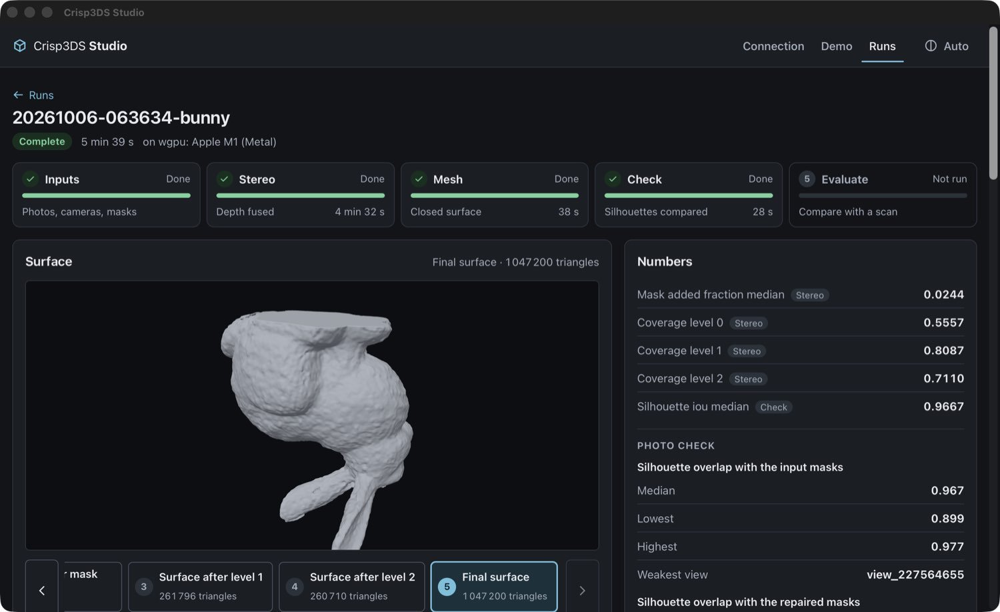 | 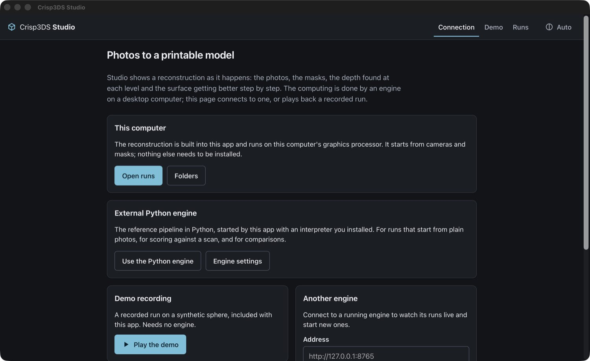 |

Not verified:

- **The Bunny live in the window**: that its previews and sheets appear while
  it runs, and that the window stays responsive meanwhile. Live progress in
  the window was verified on the sphere only (the Bunny was to be run once,
  and that run happened while the screen was locked).
- **Clicking**: the native pickers (and with them the absolute-path grant in a
  real session), the Folders screen, switching engines on the Connection
  screen, the "camera solution, images and masks" start, and the external
  Python engine after this change (its Rust tests pass).
- **Windows and Linux**: built and unit-tested in CI only. The CI runners have
  no GPU for wgpu on Linux, so the test run there ends with the engine's
  "no GPU adapter" error, which is the clean failure the app shows; on the
  macOS runner it completes on the virtual Metal device, and on the Windows
  runner on DirectX 12's software adapter. Nobody has run the app itself on
  Windows or Linux, so the window, and DirectX 12 or Vulkan on real hardware,
  are untried there.
- **Android and iOS**: the debug APK and the simulator app compile and link
  with the engine in CI. They were never installed or started.
- Starting two runs at once (nothing prevents it; they would share the GPU),
  and quitting during a long stage (covered by a unit test with a stand-in
  pipeline only).

Process handling of the external Python engine is unchanged and still
untested on Windows (`taskkill /T /F`, which also kills a run in progress)
and Linux (process group; a run in progress survives the app).

### What a self-contained photos-to-model app still needs

The dense stages no longer need Python. The plain-photos start does: masks
(SAM through PyTorch) and cameras (AliceVision executables) are external. The
plan for native providers is in `docs/ARCHITECTURE.md`; Studio's part is ready
for it (start points with provider choices). Until then the photos start is
only available through the external Python engine, and Studio has no screen
for it.

## Releases

`.github/workflows/release.yml` builds the web bundle, the bundled desktop
apps, the mobile probes and the pipeline's source archive, and on a `v*` tag
creates a **draft prerelease**. The desktop bundles contain the engine and
need no Python for runs that start from cameras and masks. `scripts/set-version.mjs` keeps
`package.json`, `tauri.conf.json` and `Cargo.toml` on one version. Signing is
off until its secrets exist: `APPLE_CERTIFICATE`,
`APPLE_CERTIFICATE_PASSWORD`, `APPLE_SIGNING_IDENTITY`, `APPLE_ID`,
`APPLE_PASSWORD`, `APPLE_TEAM_ID` (macOS), `WINDOWS_CERTIFICATE`,
`WINDOWS_CERTIFICATE_PASSWORD` (Windows). The procedure is in
[`docs/RELEASING.md`](../../docs/RELEASING.md).

## Implemented, and not

Implemented: everything under [What it shows](#what-it-shows); the replay and
HTTP and local sources; the demo; the app with the built-in engine and the
optional launcher for the external Python engine.

Not implemented:

- **Photo upload and capture.** Not in the contract yet, so a phone cannot
  send photos.
- **The plain-photos start.** Runs start from an inputs folder or from a
  camera solution with images and masks. The form can show provider choices
  for a photos start; no engine offers one to Studio yet.
- **Scoring against a reference scan** with the built-in engine (the Python
  engine does it).
- **Remembering a picked folder across restarts** in the sandboxed variant
  (security-scoped bookmarks).
- **Thumbnails and compact meshes.** Gallery cards show the full sheet scaled
  down; the contract has no thumbnail or decimated-mesh artifact yet.
- **Deleting or renaming runs, a download button for the STL**: no endpoint for
  the first two; the STL is at `<engine>/api/runs/<id>/files/mesh/mesh.stl`.
- **Engine discovery on the network** (mDNS or a QR code with address and
  token), so nobody types an address on a phone.
- **Push updates.** Studio polls, as the contract says.
- **Mesh formats other than binary STL.** A text STL is refused with a clear
  message.
- **Installable PWA / offline shell**: no service worker.
- **Translations.** English only.
- **Asking before quitting while a run is in progress.**

Runs recorded before the engine announced the photo check as a `report`
artifact still show it: for those, a live engine is asked for
`check/result.json` by its conventional path once the check stage is done.
