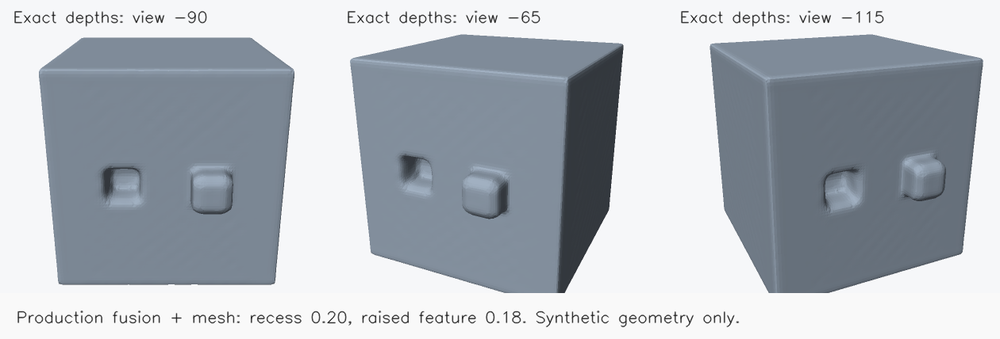

# Depth reconstruction quality audit

2026-10-09. A severe failure is reproducible in the ordinary band matcher with
perfect cameras and synthetic textured photographs. This is a concrete reason
to change matching support geometry, rather than continue smoothing damaged
meshes. It does not establish the cause of every error on real objects.

## Independent controls

`crates/dense/tests/depth_geometry_audit.rs` constructs its own analytic scene.
No scanner geometry or dataset-provided cameras, masks or depths enter it.

The coordinate control intersects independently calculated double-precision
world rays with boxes, then checks production projection/unprojection across
48 cameras, unequal focal lengths and off-centre principal points. World-point
error is below 2e-6 scene units and pixel error below .0002 px. This establishes
the tested pinhole convention, not accuracy of recovered real cameras, image
undistortion or every crop/pyramid transform.

Exact analytic depths of a box with a recess and raised feature pass through
production GPU fusion and meshing. The manually constructed outer hull contains
the features but does not encode the recess. Rim removal is zero and artificial
support flattening disabled; other fusion/mesh settings are defaults. At three
independent mesh-ray intersections:

| Surface | Analytic front Y | Exported mesh front Y |
| --- | ---: | ---: |
| Flat face | -.800000 | -.812322 |
| Recess floor | -.600000 | -.604516 |
| Raised feature | -.980000 | -.994825 |

Voxel size is .0208333; each error is below one voxel. The mesh is closed, genus
zero, with 74,772 triangles. Three rendered views were inspected: both features
survive, with softened edges and slight face rippling. This isolates fusion and
meshing with ideal evidence; it does **not** validate their response to noisy,
correlated, missing or occluded stereo depths, or the photo-to-hull front end.



## A matching failure with perfect cameras

Three parallel cameras observe a textured flat plane at camera depth 2.0.
Reference/source brightness arrays are generated directly from the plane's
texture, with exact integer disparities at truth. Geometry, photographs and
the selected centre pixel's initial depth stay fixed. Only surrounding initial
depths change from 2.0 to 2.12.

| Matching control | Correct surrounding prior | Biased surrounding prior |
| --- | ---: | ---: |
| Ordinary band refinement, cost aggregation sigma 2 | 1.999909 | 1.894572 |
| Ordinary band refinement, cost aggregation disabled | 1.999933 | 1.894488 |
| New coherent band refinement | 1.999933 | 1.999933 |
| Existing independent coherent plane scoring | 2.000000 | 2.000000 |
| Independent plane scoring after the band's result | 1.999909 | 1.998706 |

The band matcher moves a correct centre pixel about **5.27%** away from truth.
This happens before cross-view filtering, fusion or mesh smoothing. The
coherent plane control fixes this controlled failure; it is not evidence of
restored Bunny/drill detail or a six-object adoption result. It uses six
coordinate iterations, stride 1 and fixed fronto-parallel normals appropriate
to this synthetic plane; it is not a claim about the full existing slanted
configuration on real objects.

The mechanism is visible in `shaders/warp.wgsl` and `stereo/matcher.rs`: one
hypothesis adds the same inverse-depth offset to **each patch pixel's own prior
depth**. NCC then scores that deformed patch and attributes its peak to the
centre pixel. Neighbouring prior errors therefore alter the centre's data cost.
For this control the offset that corrects the surrounding prior predicts
`1 / (1/2 + (1/2 - 1/2.12)) = 1.892857` at the already-correct centre, close to
the observed failure. Aggregating cost slices indexed by these offsets adds
further coupling between corrections with different depth baselines.

Warping an entire prior surface can be useful for a coupled surface update, but
its patch score must not be treated as independent evidence for each pixel's
depth. Disabling cost aggregation reproduces the failure, isolating it from
that additional smoothing. The current implementation demonstrably fails that distinction. The
same mechanism can plausibly suppress relief or create false relief; its
contribution to actual Bunny/drill defects still requires a controlled replay.

## Comparison with established pipelines

These are implementation comparisons, not an external benchmark on our images.
Revisions and reproduction values are in
[`depth-geometry-audit.json`](../tests/evidence/depth-geometry-audit.json).

| Stage | Established implementation | Current ordinary Crisp3DS path |
| --- | --- | --- |
| Photometric support | COLMAP derives a patch homography from the centre's candidate depth and normal. | Band refinement warps patch pixels using their individual prior depths plus a common inverse-depth offset. |
| Geometric evidence | COLMAP's geometric stereo evaluates source-depth forward/backward reprojection during optimisation. | Ordinary band matching is photometric; a later filter counts relative depth agreement at rounded projections. |
| Fusion checks | COLMAP checks depth, projection and normals, requires multiple supporting samples and takes median coordinates. OpenMVS dense fusion also tracks depth/confidence/normals, reprojection thresholds and multi-view support. | TSDF receives accepted depths with uniform near-surface votes and explicit free-space/behind-surface votes; ordinary fusion does not receive photometric confidence, source identities or normals. |
| Volume integration | Open3D integrates calibrated depth into a TSDF with a truncation band; its classic implementation also converts Z differences to ray distances. | Calibrated camera-Z differences are integrated with a fixed voxel truncation and an extra weaker behind-surface band, followed by hull-aware field completion and meshing. |

Sources: [COLMAP patch scoring and geometry](https://github.com/colmap/colmap/blob/4ae1aafb16d5eae3d54552b2fc896a4fc9d0f7f4/src/colmap/mvs/patch_match_cuda.cu),
[COLMAP fusion](https://github.com/colmap/colmap/blob/4ae1aafb16d5eae3d54552b2fc896a4fc9d0f7f4/src/colmap/mvs/fusion.cc),
[OpenMVS densification/fusion](https://github.com/cdcseacave/openMVS/blob/a3b6d0d99800a65af6b5f6b20dcc1df4c9e0e0c4/libs/MVS/SceneDensify.cpp),
[Open3D integration](https://github.com/isl-org/Open3D/blob/b6c5e196384ad71e75b6e6f9c5da22d046221f1d/cpp/open3d/pipelines/integration/UniformTSDFVolume.cpp).
No upstream algorithm code was incorporated. OpenMVS is a comparison source,
not a permitted source-code adoption under the owner's permissive-code rule.
Source licenses do not establish patent clearance; prior research restrictions
remain in effect.

## Consequence for further work

An experimental `coherent_band=true` now replaces the band's patch cost with
a coherent candidate surface cost at every finer-level and hull-front refinement.
It searches the full existing inverse-depth band at stride 1, using the centre's
candidate depth and a local-prior normal held fixed during the search. The
coarsest fronto-parallel sweep is unchanged. Offset-indexed cost aggregation is
bypassed because neighbouring centres have different prior depth baselines.
Ordinary default behaviour remains unchanged. Adding only a final slanted
polish leaves earlier matching and filtering damage in the initial surface.
The same perfect-camera control now tests the production coherent band entry:
it keeps depth 1.999933 with either surrounding prior. GPU candidate scores are
checked against independent scalar plane scoring on a synthetic curved surface.
Real photo-only Bunny/drill replays use identical recovered inputs and fixed
evaluation alignments; see [coherent-band evidence](../tests/evidence/coherent-band-review.json).

Then test geometric reprojection and uncertainty-aware fusion as separate
changes. Extra rejection alone can make an already patchy map worse; support
and confidence must remain attached to the evidence. A point-cloud fusion
control can isolate TSDF carving from matching errors. Neither path should
claim quality from a closed mesh, increased coverage or a texture covering it.
Dense defaults still require the existing six-object numerical and visual gate
plus browser execution/memory checks. No defaults change in this audit.

Run the controls serially with a GPU:

```sh
CRISP3DS_GPU_TESTS=1 RAYON_NUM_THREADS=2 cargo test --release \
  --manifest-path crates/dense/Cargo.toml --test depth_geometry_audit \
  -- --nocapture --test-threads=1
```

`CRISP3DS_AUDIT_OUTPUT` optionally retains a newly created mesh directory.
Without it, the test deletes its own mesh output. Camera-ray checks run even
when GPU tests are disabled. The band failure is reported diagnostically; the
test does not assert that the erroneous result is acceptable.


## Real-image correction and limits

Against the same supported-fallback/distinct-mode baseline, strict Bunny head
F1 at .1% of the reference diagonal improves from .612953 to .641016; mean
head surface error falls about 9.9%. Drill F1 at .5/1/2% improves from
.455286/.701277/.929251 to .481374/.720322/.940236, and mean surface error falls
about 4.5%. Reference geometry is consumed only for posthoc evaluation. Local
paired head and whole-object renders were inspected: eyes/nose remain weak and
the drill still has severe pits. This is a measurable correction, **not** an
acceptable completed reconstruction workflow.

Several follow-ups fail on drill: stride-2 patch sampling drops 2% F1 by .0395;
adding the existing finest normal refinement drops it by .0715; a 12-degree
minimum matching angle also worsens accuracy. A separate immutable raw-depth
round-trip filter with a 1-pixel limit slightly lowers all three drill F1 scores.
These changes are not incorporated into the coherent option. In particular,
extra rejection alone does not establish more reliable fusion evidence.

The corrected browser photo pipeline completes all 60 drill photos and exports
an original-RGB textured GLB. WASM high-water memory is 1.24 GiB; this is not
browser/GPU process memory. The mesh is still open and about 31.6% of its area
has no selected texture. Texturing preserves the geometry and does not repair
its defects. Timing is one serial run, not a controlled speed comparison.


The combined option fails the default gate on Lucy: .5% above-support F1 drops
.00327045 versus ordinary defaults (allowed loss .003). Against the same
supported-fallback/distinct-mode baseline the drop is .00232646, isolating the
additional matcher contribution. The adoption run stopped there; Armadillo,
Dragon, Thai statue and Happy Buddha were not run for this candidate. No default
or successful-six-object claim follows from Bunny improvement.

Fusion-weight replays reuse the exact corrected drill depth file. Reducing
free-space weight to .25 improves strict .5% F1 (.481374 to .492182) but reduces
2% F1 (.940236 to .932007) and increases mean error. Removing the additional
behind-surface votes worsens every threshold, with or without the reduced
free-space weight. Inspected meshes remain badly pitted. These are negative
controls, not an uncertainty-aware fusion implementation or adopted changes.


A final private check changes existing normal refinement to stride 1, keeping
all other settings and inputs fixed. Strict drill F1 increases slightly to
.489211, but 2% F1 falls to .888842 from .940236, and mean error grows. Denser
sampling therefore does not remove the combination's broad loss. This one-line
experiment is reverted; the production coherent band continues using stride 1
while the separate legacy normal-refinement option is unchanged.
